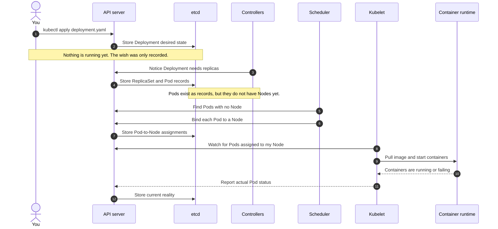

I wasted my first few weeks with Kubernetes because I thought of it as a deployment tool. You give it a container, it runs the container, done — a fancier `docker run`. Every confusing behavior I hit traces back to that wrong model. Kubernetes is not a tool that does things when you ask. It's a system that *continuously corrects reality* toward a state you described. Once that clicked, half the weirdness stopped being weird.

This is the reference post for that mental model. The [series overview](/blog/devops/1-the-system-were-building) explains what we're building (Relay, a URL shortener); this post explains the machine we're building it on. If you're here from a later post because some kubectl output made no sense, this is the foundation.

## The mental model: a thermostat, not a script

When you deploy something with a shell script, the script runs once. If a server dies at 3am, the script does not care. It already ran. It went home.

Kubernetes works like a thermostat. You don't tell a thermostat "turn on the heater for 20 minutes." You tell it "make it 21°C" and it forever compares the actual temperature against that number, nudging the heater on and off. You declare **desired state**; the system measures **actual state**; a loop closes the gap. Forever.

Everything in Kubernetes is this pattern:

- You say "I want 3 replicas of `relay-api`."
- Something watches how many actually exist.
- A pod dies → actual is 2, desired is 3 → a new pod gets created. Not because anyone asked. Because the numbers didn't match.

These watching-and-correcting things are called **controllers**, and the pattern is a **reconciliation loop**. Kubernetes is dozens of these loops running concurrently, each responsible for one small gap between desired and actual. That's the whole trick. There is no grand orchestrator with a plan. There's a pile of thermostats.

The practical consequence, and it's a big one: **you stop doing things and start declaring things.** You don't restart crashed containers — you declare that 3 should exist and let the loop restart them. You don't carefully replace servers one at a time during a deploy — you declare a new image version and a loop performs the rollout. Your job shifts from *operating* the system to *describing* it.

## The vocabulary: Pods and Nodes

Two words carry most of Kubernetes, so let's pin them down.

A **Node** is a machine. Physical, virtual, or — in our [k3d setup](/blog/devops/4-kubernetes-running-locally) — a Docker container pretending to be a machine. Nodes are where work actually runs. They're the boring part.

A **Pod** is the unit Kubernetes schedules. Not a container — a Pod. A Pod is one or more containers that are glued together: they share an IP address, share localhost, live on the same Node, and are born and die as a unit. In practice, 95% of your Pods hold exactly one container, and mentally substituting "container, plus Kubernetes bookkeeping" gets you a long way.

But here's the thing that took me embarrassingly long to internalize:

**Pods are cattle. Aggressively, deliberately cattle.**

A Pod is never healed. If the Node it's on dies, the Pod is gone — a *replacement* Pod gets created elsewhere, with a new name and a new IP. If a rollout replaces it, gone. Kubernetes does not move Pods, does not resuscitate Pods, does not apologize for Pods. Every layer above (Services, Deployments) exists specifically because Pods are this disposable. When Relay's redirect latency spiked and I went looking for "the pod handling that request," it had already been replaced twice. That's normal. That's the design.

## The control plane: who's actually doing all this

The reconciliation loops have to run somewhere. That somewhere is the **control plane** — the brain of the cluster, as opposed to the worker Nodes doing the actual work. Four pieces matter:

**The API server** is the front door — the *only* door. Every kubectl command, every controller, every Node component talks to the cluster exclusively through this one HTTP API. Nothing sneaks around it. When you run `kubectl get pods`, you're making a REST call. This matters more than it sounds: it means the entire system state is inspectable through one interface, which is why `kubectl get` and `kubectl describe` can show you everything.

**etcd** is the database. Every object you create — every Deployment, Service, Secret — is a record in etcd. Desired state lives here. Lose etcd, lose the cluster's memory. (You never touch it directly; the API server is its only client.)

**The scheduler** answers exactly one question: *this Pod exists but has no Node — which Node should run it?* It looks at resource requests, constraints, and spreads things out sensibly. It doesn't start anything. It just writes an answer ("this Pod goes on node-2") back through the API server. That's it. That's the whole job.

**The controller manager** runs the thermostats — the reconciliation loops from earlier. The Deployment controller, the ReplicaSet controller, the Job controller, dozens more, each watching the API server for gaps between desired and actual, each writing corrections back.

And on every Node sits the **kubelet** — the control plane's agent in the field. It watches the API server for "Pods assigned to my Node," tells the container runtime to actually start the containers, and reports back what's really happening. The kubelet is where declared intent finally touches a real Linux process.

Watch the chain when you deploy Relay:



1. `kubectl apply` → API server → the Deployment is written into etcd. **Nothing is running yet.** You've expressed a wish.
2. Deployment controller notices, creates a ReplicaSet. ReplicaSet controller notices, creates 3 Pod records. Still nothing running — these Pods have no Node.
3. Scheduler notices unassigned Pods, picks Nodes for them.
4. Each kubelet notices Pods assigned to its Node, pulls images, starts containers.

Four independent loops, none of which know about each other, each closing its own gap. `kubectl apply` returning successfully means step 1 finished. Only step 1. This is why apply "succeeds" and your Pod is still `ImagePullBackOff` thirty seconds later — the wish was recorded; reality is still being negotiated. Check reality with `kubectl get pods -w`.

## Why you almost never want a bare Pod

You *can* create a Pod directly:

```yaml
apiVersion: v1
kind: Pod
metadata:
  name: relay-api
spec:
  containers:
    - name: relay-api
      image: relay-api:v1
      ports:
        - containerPort: 3000
```

Don't. A bare Pod has no thermostat. If it crashes, the kubelet will restart the *container* in place, but if the Node dies or the Pod is evicted, nothing recreates it. No loop is watching. You've opted out of the entire point of Kubernetes and built a slightly worse `docker run`.

What you want is a **Deployment**:

```yaml
apiVersion: apps/v1
kind: Deployment
metadata:
  name: relay-api
spec:
  replicas: 3
  selector:
    matchLabels:
      app: relay-api
  template:
    metadata:
      labels:
        app: relay-api
    spec:
      containers:
        - name: relay-api
          image: relay-api:v1
          ports:
            - containerPort: 3000
```

The `template:` block is the same Pod spec as before — a Deployment is literally "a Pod description, plus desired state *about* Pods." Those extra lines buy you: replacement when Pods die anywhere for any reason, `replicas: 3` as a declared number instead of a manual chore, and rolling updates when you change the image ([post 06](/blog/devops/6-multi-replica-scaling) breaks that machinery open). Deployments aren't the only Pod-managing controller — StatefulSets and DaemonSets exist for specific shapes of workload, and [the workload types post](/blog/devops/3-deployments-statefulsets-daemonsets) is the map — but Deployment is the default, and "which controller owns my Pods" should always have an answer.

The `selector`/`labels` pairing looks redundant and isn't. Kubernetes has no hidden ownership pointers — the Deployment finds "its" Pods by label query, at runtime, every loop iteration. Labels are the connective tissue of the whole system (Services route by them too, which is a [networking post](/blog/devops/5-kubernetes-networking-services-dns) matter). Typo a label so the selector doesn't match and you'll get genuinely baffling behavior — I've done it, and the error message is nothing at all.

## Declarative vs imperative, and the trap

kubectl has imperative commands: `kubectl run`, `kubectl scale`, `kubectl set image`. They work by editing the desired state for you. They're fine for experiments and emergencies.

But here's the trap that bit me: **the cluster is not your source of truth — your YAML files are.** If you `kubectl scale deployment relay-api --replicas=5` in a 2am panic and your Git repo still says `replicas: 3`, the next `kubectl apply` silently undoes your fix. The cluster forgot your 2am intervention because the cluster only ever knew *state*, not *history*. Discipline: change the file, `kubectl apply -f` the file, commit the file. Imperative commands are for finding out what you want; declarative files are for keeping it.

## The misconceptions that cost me time

**"Kubernetes will fix my broken app."** No. It will *restart* your broken app, forever, very efficiently. A crash-looping Pod restarts with increasing backoff (`CrashLoopBackOff` — you'll meet it), but if the bug is in your code, the loop just makes the failure rhythmic. Reconciliation heals infrastructure-shaped problems, not logic-shaped ones.

**"Deleting a Pod is destructive."** Usually the opposite — it's the standard way to get a fresh one, because the ReplicaSet's loop immediately replaces it. `kubectl delete pod` on a Deployment-managed Pod is closer to "restart" than "delete." (On a *bare* Pod it really is destructive. Another reason not to have those.)

**"The control plane runs my traffic."** It doesn't. The control plane decides and records; your actual requests flow Node-to-Pod without the API server involved. Control plane down is bad — no new Pods, no rollouts, no self-healing — but existing Pods keep serving. Brain-dead, body running.

**"Things happen in order."** They don't. Loops are independent and asynchronous. Apply five files and they reconcile concurrently; a Pod can be scheduled before the Secret it mounts exists (it'll fail, then a loop retries, then it works). Eventual consistency is the texture of everything here. Impatience reads as breakage; usually it's just step 3 of 4.

## Where this leaves us

The model, compressed: **etcd holds what you want, kubelets make what's real, controllers argue the two into agreement, and the API server is the room where it happens.** Every object you'll ever create — Deployment, [Service](/blog/devops/5-kubernetes-networking-services-dns), [PVC](/blog/devops/7-persistent-storage-pvs-pvcs), [HPA](/blog/devops/9-horizontal-pod-autoscaling) — is a desired-state record with a loop behind it. When something misbehaves, the debugging question is never "what did I run?" It's "what did I declare, and which loop is stuck closing the gap?" `kubectl describe` shows you the loop's complaints; that's what the Events section at the bottom is.

Next up: not all Pod-managers are Deployments. Before we deploy Relay for real, [Deployments vs StatefulSets vs DaemonSets](/blog/devops/3-deployments-statefulsets-daemonsets) covers when interchangeable cattle is the wrong model — which is going to matter the moment we add Postgres.
