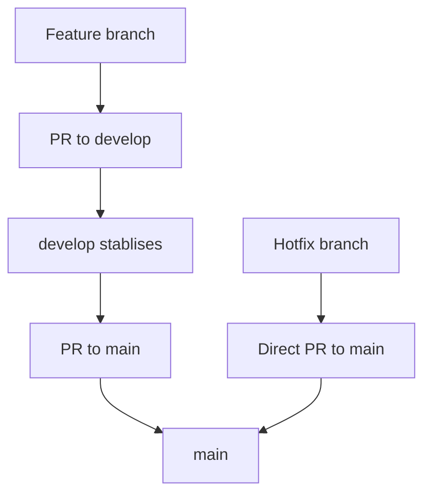

I’ve worked across four internships, shipped open-source work, and spent enough time in real codebases to learn this the hard way: good engineering is mostly judgment. Not flashy judgment — the quiet kind that decides what to build, what to skip, what to fix, and what to document so the next person doesn’t suffer.

These are the things I keep in mind whenever I join a new codebase or start building something that other people will actually use.

## When you open a new codebase, map it first

Before I touch anything, I want the flow of the app in my head.

I usually start by drawing the workflow, then I verify it with someone who already understands the system better than I do. That first pass matters more than people think. It gives you a written map, helps you avoid random edits, and makes the rest of the work much easier to reason about.

Then I go feature by feature, or service by service.

That habit helps in two ways:

- it makes the system easier to understand
- it creates documentation for the next person who takes over

AI tools make this faster, but they don’t replace the thinking. They just help you get to the thinking sooner.

## Treat git flow like an actual system

I like keeping the release path simple:

- `main` is production
- `develop` is staging
- feature branches go into `develop`
- once things are stable, `develop` moves into `main`
- hotfixes go directly to production when something is broken

That structure keeps the stable service stable while still letting changes move quickly.

It also gives you a clean answer when something goes wrong. You know where the issue entered, where it should be fixed, and what should or shouldn’t be merged yet.

## Build backend systems like they need to survive

On the backend, the goal is not just to make something work once. The goal is to make it organized enough that it can keep working.

A few things I keep in mind:

- break the app into modules
- keep auth, profile, fetching, and background work separated
- distribute load instead of letting one part do everything
- use TurboRepo when API, workers, and frontend need to live together cleanly
- use BullMQ for messaging and job processing when background work needs to be reliable

Good backend structure is invisible when it works. You only notice it when it’s missing.

## UI and frontend: think like the user

When I build UI, I try to be the user first.

- Will I actually notice this?
- Will I understand what this button does?
- Is this really required?
- Can I merge this into something simpler?
- Will this affect the UX in a good way or just add noise?

That’s why I don’t like using cards everywhere. Sometimes text-only layouts with good spacing and a clean hover effect are enough. Sometimes they’re better. Icons can help too, especially when they keep the page simple instead of making it busy.

Spacing matters a lot here — gaps, margins, and paddings are not tiny details. They are the design. (learned the hard way)

And if something feels off, I like to critique it hard. If I can’t explain why the UI exists, or if a button’s purpose isn’t obvious, it probably needs another pass.

### Ask for criticism early

A design usually improves when someone senior looks at it and questions it.

I’ve found it useful to show work early and let people push back. They notice things I stop seeing after staring at the same screen for too long.

That kind of feedback has saved me from shipping unnecessary UI more than once.

## Ownership means fixing the adjacent thing too

Ownership is not just finishing the ticket you were assigned.

If someone asks for a button color change on one page, I should also check whether nearby pages now look inconsistent or broken. If I spot something off, I should fix it instead of creating more process for no reason.

That behavior builds trust because it shows you’re thinking about the whole system, not just the narrow task in front of you.

## Communicate clearly when a task is not realistic

Early in internships or new jobs, it’s normal to feel nervous. I’ve been there too. But nervousness should not turn into vague communication.

If something is going to take time, say that clearly.

If a request sounds too optimistic, explain why and use the right terms so the other person understands the actual work involved.

Being honest about scope is better than pretending something can be done in one day just because that sounds nicer in the room.

## Not every environment is equally serious

Sometimes you’ll work with people who are deeply committed. Other times, not so much.

When that happens, the safest move is still to do your work well and keep improving your knowledge and skills along the way.

Also: make progress reports.

It’s a small thing that saves a lot of future pain and helps you clearly answer, whenever asked: “What have you done?”

## Go beyond just using tools

Sometimes you have to come back to a tool you haven’t touched in a while. AI makes the syntax or commands feel easy again, but that was never the whole point.

What matters more is understanding what the tool is actually good at:

- Why choose this over an alternative?
- What are the trade-offs?
- What problem does it solve better?
- When should you reach for something else?

Read articles. Read implementation details. Build something with the tool instead of only following instructions. That’s where you start understanding not just how to use it, but why you’re using it.

## Final note

The most useful lesson I keep coming back to is simple: build with judgment.

Think about the user. Think about the system. Think about the next person who has to read your code.

If something looks unnecessary, question it.
If something looks broken, fix it.
If something is unclear, document it.
If something is unrealistic, say so clearly.

That’s the kind of work that compounds.
